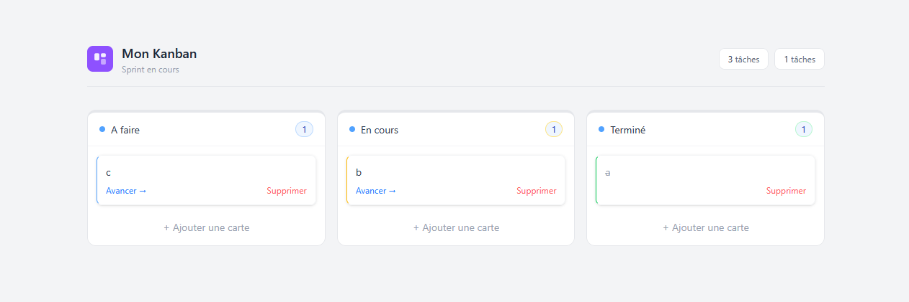

# Kanban Board

Une application de gestion de tâches construite avec Next.js 14, TypeScript et Zustand

## Stack technique

- **Next.js 14** (App Router)
- **TypeScript** (mode strict)
- **Zustand** - gestion d'état avec persistance localStorage
- **Tailwind CSS v4** - styles utilitaires
- **Jest + React Testing Library** - tests unitaires

## Lancer le projet

### Prérequis
- Node.js 18+
- npm

### Installation

1. Cloner le repo
```
git clone https://github.com/TheoCoignet/kanban-board
cd kanban-board
```

2. Installer les dépendences
```
npm install
```

3. Lancer en développement
```
npm run dev
```

4. Lancer les tests
```
npm test
```

### Build de production

npm run build

## Aperçu



> Demo live : [kanban-board-test.netlify.app](https://kanban-board-test.netlify.app/)

## Architecture

Le projet suit une organisation **feature-based** :
```
src/
├─ app/                 # Layout et page principale Next.js
├─ features/
│  └─ board/             # Feature Kanban
│     ├─ components/
│     ├─ store/
│     ├─ __tests__/
└─ shared/
   ├─ components/
   └─ types/
```

## Choix techniques

** Zustand plutôt que Redux** - plus léger, sans boilerplate, suffisant pour la complexité de ce projet. Le middleware `persist` gère la persistance localStorage automatiquement.

**Organisation feature-based** - chaque feature est autonome et isolée. Ajouter une nouvelle feature ne touche pas aux existantes.

**TypeScript strict** - les entités métier (Card, Column, Board) sont entièrement typées. L'usage de types union littéraux (`CardStatus`) garantit l'exhaustivité des cas à la compilation.

## Fonctionnalités

- Créer des tâches dans n'importe quelle colonne
- Déplacer une tâche vers la colonne suivante
- Supprimer une tâche
- Persistance automatique entre les sessions (localStorage)